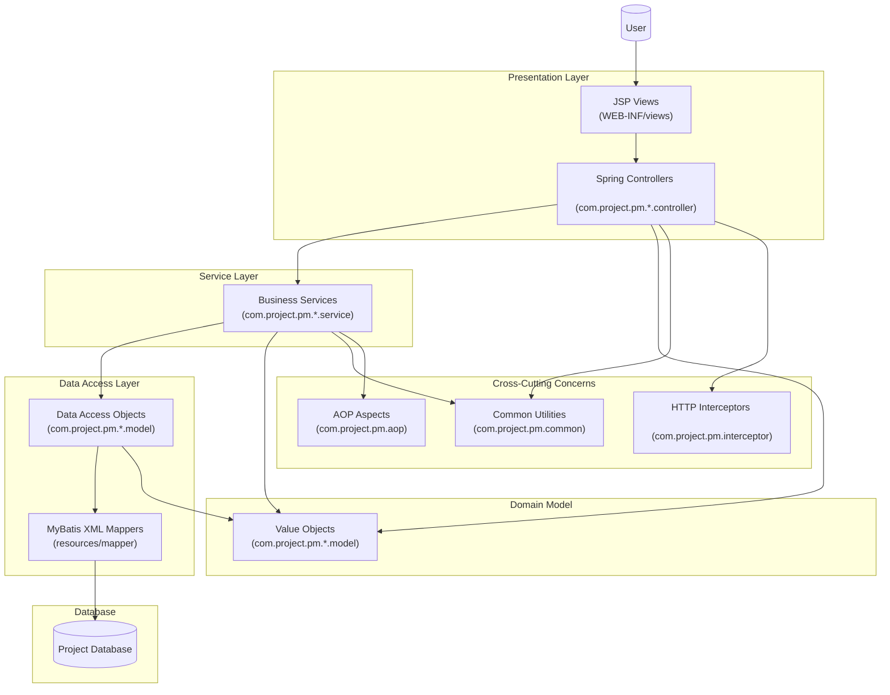

```mermaid
graph TD
    subgraph "Presentation Layer"
        direction LR
        Views["JSP Views </br> (WEB-INF/views)"]
        Controllers["Spring Controllers </br> (com.project.pm.*.controller)"]
    end

    subgraph "Service Layer"
        Services["Business Services </br> (com.project.pm.*.service)"]
    end

    subgraph "Data Access Layer"
        direction LR
        DAOs["Data Access Objects </br> (com.project.pm.*.model)"]
        Mappers["MyBatis XML Mappers </br> (resources/mapper)"]
    end

    subgraph "Domain Model"
        VOs["Value Objects </br> (com.project.pm.*.model)"]
    end

    subgraph "Cross-Cutting Concerns"
        AOP["AOP Aspects </br> (com.project.pm.aop)"]
        Interceptors["HTTP Interceptors </br> (com.project.pm.interceptor)"]
        Common["Common Utilities </br> (com.project.pm.common)"]
    end

    subgraph "Database"
        DB[(Project Database)]
    end

    User[("User")] --> Views
    Views --> Controllers

    Controllers --> Services
    Controllers --> VOs
    Controllers --> Common
    Controllers --> Interceptors

    Services --> DAOs
    Services --> VOs
    Services --> Common
    Services --> AOP

    DAOs --> Mappers
    DAOs --> VOs
    
    Mappers --> DB
```
