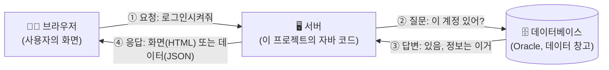
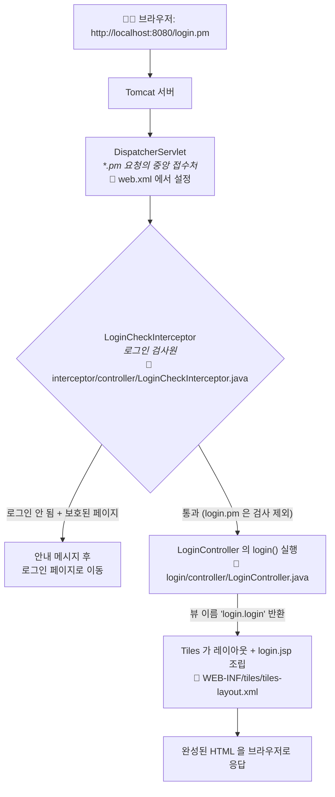
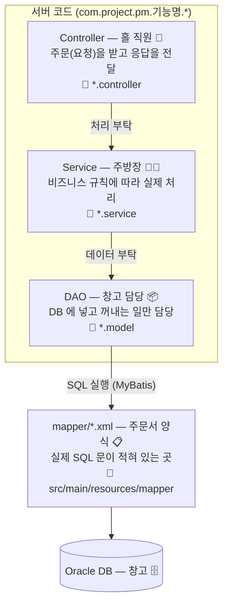
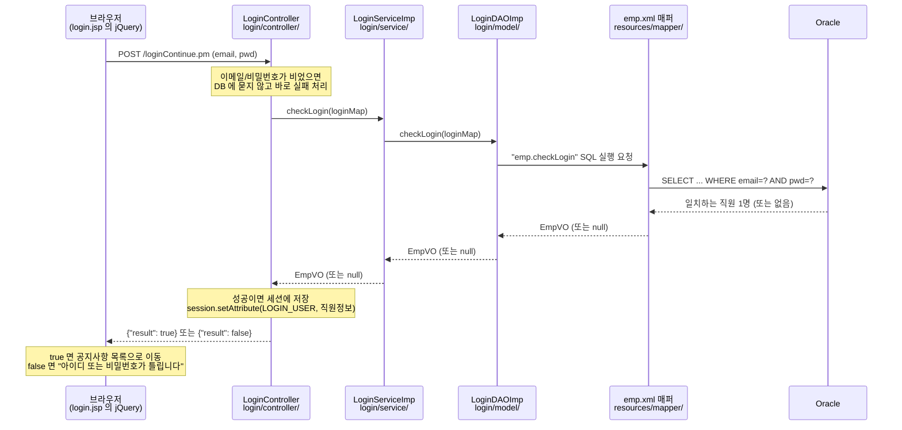
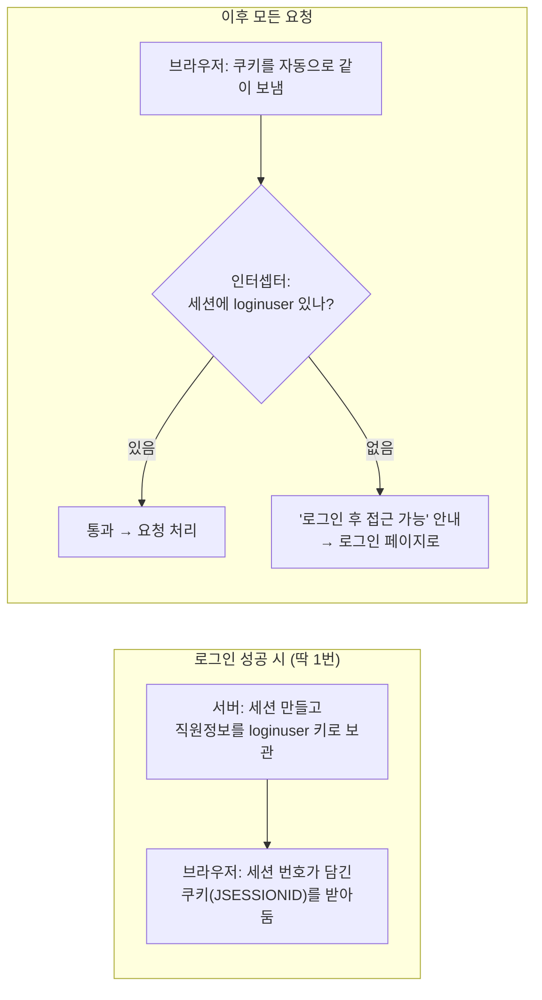
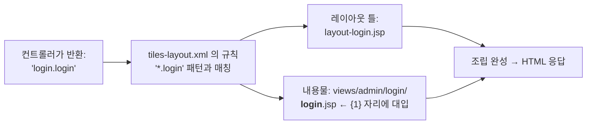
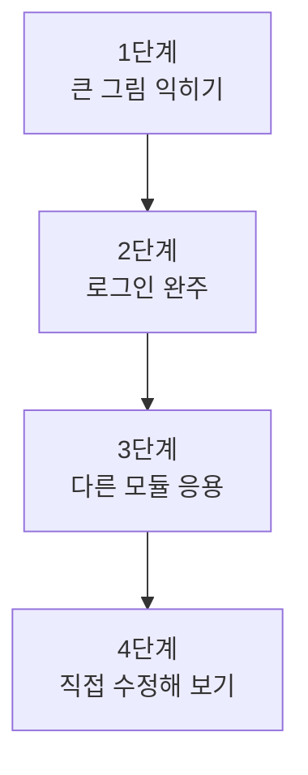

# 비전공자를 위한 PM 그룹웨어 구조 이해 가이드

> 이 문서는 **프로그래밍을 전공하지 않은 사람**이 이 프로젝트의 구조를 이해하고,
> 실제 코드를 따라 읽으며 개발 공부를 시작할 수 있도록 쓴 안내서입니다.
> 모든 도식은 GitHub 에서 자동으로 그림으로 표시됩니다(Mermaid).
>
> 읽는 순서: 위에서 아래로. 중간에 모르는 용어가 나오면 [9. 용어 사전](#9-스프링-용어-미니-사전)을 참고하세요.

---

## 1. 가장 큰 그림: 웹 서비스는 3명의 등장인물로 움직인다

어떤 웹 서비스든 등장인물은 셋입니다.



- **브라우저**: 사용자가 보는 화면. 버튼을 누르면 서버에 "요청"을 보냅니다.
- **서버**: 요청을 받아 규칙(비즈니스 로직)에 따라 처리하는 곳. **이 저장소의 자바 코드 전부가 서버에서 실행됩니다.**
- **데이터베이스(DB)**: 직원 정보, 공지사항, 휴가 내역 같은 데이터가 저장된 창고. 이 프로젝트는 Oracle 을 씁니다.

이 프로젝트는 회사에서 쓰는 **그룹웨어**(로그인, 공지, 근태, 휴가, 전자결재, 쪽지)를 구현한 것입니다.

---

## 2. 이 프로젝트의 기술 스택 — 각각 한 줄로

| 이름 | 정체 | 비유 |
|---|---|---|
| **Java** | 서버 코드를 작성한 프로그래밍 언어 | 요리사가 쓰는 언어 |
| **Tomcat** | 자바 웹 서버 프로그램. 브라우저의 요청을 받아 우리 코드에 전달 | 건물(매장) 자체 |
| **Spring (Spring MVC)** | 자바 웹 개발의 뼈대(프레임워크). "요청을 어떤 코드에 연결할지" 등 반복 작업을 대신 해줌 | 매장 운영 매뉴얼 + 매니저 |
| **MyBatis** | 자바 코드와 SQL(DB 질의어)을 연결해 주는 도구 | 주방과 창고 사이의 주문서 양식 |
| **Oracle** | 데이터베이스 제품 | 창고 |
| **JSP + Tiles** | 서버에서 HTML 화면을 만들어 내는 기술. Tiles 는 "공통 틀 + 내용물" 조립 담당 | 요리를 담는 접시 + 상차림 규칙 |
| **Maven** | 라이브러리 내려받기와 빌드(컴파일→포장)를 자동화하는 도구 | 식자재 발주 + 포장 시스템 |
| **jQuery(AJAX)** | 화면 전체를 새로 고치지 않고 서버와 데이터만 주고받는 브라우저 쪽 기술 | 홀에서 주방으로 보내는 쪽지 |

---

## 3. 요청 하나의 여행: 주소창에 `login.pm` 을 치면 생기는 일

이 프로젝트의 모든 주소는 `~.pm` 으로 끝납니다 (`web.xml` 에 그렇게 설정되어 있음).
`*.pm` 요청이 들어오면 스프링의 **DispatcherServlet**(중앙 접수처)이 전부 받아서 알맞은 담당자에게 배분합니다.



핵심만 기억하세요:

1. **`web.xml`** — "`.pm` 으로 끝나는 요청은 전부 스프링이 받는다"는 선언.
2. **인터셉터** — 컨트롤러에 도착하기 **전에** 끼어들어 로그인 여부를 검사하는 문지기. (로그인 페이지 등 일부 주소는 검사 제외 목록에 있음 — `servlet-context.xml` 참고)
3. **컨트롤러** — 주소(`/login.pm`)와 자바 메서드를 연결하는 접수 담당.
4. **뷰 이름 → Tiles → JSP** — 컨트롤러가 "이 화면 보여줘"라고 이름만 말하면, Tiles 가 공통 틀에 내용 JSP 를 끼워 HTML 을 완성합니다.

---

## 4. 서버 코드의 3계층 구조 — 식당에 비유하면

이 프로젝트의 모든 기능(로그인, 공지, 휴가…)은 똑같은 3단 구조로 되어 있습니다.
**한 기능의 구조를 이해하면 나머지 전부를 읽을 수 있습니다.**



왜 굳이 나눌까요? **역할이 섞이면 고치기 어려워지기 때문입니다.**
홀 직원이 요리도 하고 창고 정리도 하는 식당은, 메뉴 하나 바꿀 때마다 모든 직원 교육을 다시 해야 합니다.
계층을 나누면 "SQL 만 바꾸고 싶다 → mapper XML 만", "화면 응답만 바꾸고 싶다 → Controller 만" 건드리면 됩니다.

각 계층에 붙는 스프링 표식(어노테이션):

| 계층 | 어노테이션 | 뜻 |
|---|---|---|
| Controller | `@Controller` | "나는 요청 접수 담당이야" |
| Service | `@Service` | "나는 비즈니스 로직 담당이야" |
| DAO | `@Repository` | "나는 DB 접근 담당이야" |

그리고 계층 사이의 데이터는 **VO**(Value Object, 예: `EmpVO` = 직원 정보 묶음)라는 상자에 담아 주고받습니다.

---

## 5. 실전 예제: 로그인 버튼을 누르면 일어나는 일 (코드 따라 읽기)

이 프로젝트에서 가장 읽기 좋은 예제가 **로그인**입니다. 파일 4개만 따라가면 됩니다.
아래 순서대로 실제 파일을 열어서 대조해 보세요.



따라 읽기 순서:

| 순서 | 파일 | 볼 것 |
|---|---|---|
| ① | `src/main/webapp/WEB-INF/views/admin/login/login.jsp` | 234행 근처 — jQuery 가 `/loginContinue.pm` 으로 email/pwd 를 보내는 부분 |
| ② | `src/main/java/com/project/pm/login/controller/LoginController.java` | `loginContinue()` — 값 검증 → 서비스 호출 → 세션 저장 → `{"result": ...}` 응답 |
| ③ | `src/main/java/com/project/pm/login/service/LoginServiceImp.java` | 컨트롤러와 DAO 사이의 다리 역할 (지금은 위임만 하지만, "규칙"이 생기면 여기에 붙음) |
| ④ | `src/main/java/com/project/pm/login/model/LoginDAOImp.java` | `sqlsession.selectOne("emp.checkLogin", ...)` — SQL 을 이름으로 부름 |
| ⑤ | `src/main/resources/mapper/emp.xml` | `<select id="checkLogin">` — 실제 SQL 문 |

> 💡 `"emp.checkLogin"` 이라는 문자열이 자바(④)와 XML(⑤)을 연결하는 열쇠입니다.
> `emp` = emp.xml 의 namespace, `checkLogin` = 그 안의 `<select id>`.

---

## 6. 세션: 서버가 "너 아까 로그인했잖아"를 기억하는 방법

HTTP 요청은 원래 **매번 처음 보는 사이**입니다. 그래서 로그인 상태를 기억하려면 장치가 필요합니다.



- 비유: 회사 로비에서 신분 확인 후 **출입증**(세션 쿠키)을 받으면, 이후에는 출입증만 보여주고 다니는 것.
- 코드에서 세션 키 `"loginuser"` 는 `common/SessionConst.java` 에 상수로 모아 두었습니다. (문자열 오타로 인한 버그 방지 — 리팩토링에서 개선된 부분)
- 로그아웃(`/logout.pm`)은 세션을 통째로 무효화합니다 = 출입증 회수.

---

## 7. 화면이 조립되는 방법: Tiles

컨트롤러는 `"login.login"` 처럼 **뷰 이름**만 돌려줍니다. 이 이름을 Tiles 가 해석합니다.



- 규칙 파일: `src/main/webapp/WEB-INF/tiles/tiles-layout.xml`
- `"noticeList.admin"` 이면? → `*.admin` 규칙 → admin 레이아웃(사이드바 포함) + `views/admin/noticeList.jsp`
- 왜 쓰나? 모든 페이지에 반복되는 머리글/사이드바를 **한 곳에서만** 관리하기 위해서입니다.

---

## 8. 폴더 지도: 어디에 뭐가 있나

```
PM/
├── pom.xml                        ← Maven 설정: 사용하는 라이브러리 목록 + 빌드 방법
├── docs/                          ← 문서 (이 가이드, 리팩토링 문서)
└── src/
    ├── main/
    │   ├── java/com/project/pm/   ← ★ 서버 자바 코드 (기능별 폴더)
    │   │   ├── login/             ←   로그인 (controller / service / model 3계층)
    │   │   ├── notice/            ←   공지사항 (로그인 후 첫 화면)
    │   │   ├── employee/          ←   직원 관리
    │   │   ├── commute/           ←   출퇴근
    │   │   ├── leave/             ←   휴가
    │   │   ├── workflow/          ←   전자결재
    │   │   ├── messenger/         ←   쪽지
    │   │   ├── interceptor/       ←   로그인 검사 문지기
    │   │   ├── common/            ←   공용 도구 (암호화, 파일, 세션 키 상수 등)
    │   │   └── aop/               ←   공통 부가기능 (알림 자동 생성 등)
    │   ├── resources/
    │   │   ├── mapper/            ← ★ SQL 모음 (emp.xml, notice.xml, ...)
    │   │   ├── log4j2.xml         ←   로그 설정
    │   │   └── application-local.example.properties ← DB 계정 등 로컬 설정 견본
    │   └── webapp/
    │       ├── WEB-INF/
    │       │   ├── web.xml        ← ★ 출발점: *.pm 요청을 스프링에 연결
    │       │   ├── spring/        ← ★ 스프링 설정 (DB 연결, 인터셉터 등록 등)
    │       │   ├── tiles/         ←   화면 조립 규칙 + 공통 레이아웃 JSP
    │       │   └── views/         ← ★ 화면 JSP 파일들
    │       └── resources/         ←   브라우저용 정적 파일 (JS, CSS, 이미지)
    └── test/java/                 ←   자동 테스트 코드 (mvn test 로 실행)
```

★ 표시 5곳만 알면 코드의 90% 를 찾아갈 수 있습니다.

---

## 9. 스프링 용어 미니 사전

| 용어 | 쉬운 설명 |
|---|---|
| **프레임워크** | "웹 서버 만들 때 누구나 하는 반복 작업"을 미리 만들어 둔 뼈대. 우리는 빈칸(비즈니스 로직)만 채움 |
| **Bean(빈)** | 스프링이 대신 만들어서 관리해 주는 객체. `@Controller`, `@Service`, `@Repository` 가 붙은 클래스는 서버 시작 시 스프링이 자동으로 1개씩 만들어 보관 |
| **DI (의존성 주입)** | 필요한 부품을 직접 만들지 않고 스프링이 **넣어 주는** 것. 예: `LoginController` 생성자에 `LoginService` 를 스프링이 알아서 전달. 부품 교체(가짜 부품으로 테스트 등)가 쉬워짐 |
| **어노테이션 (@표식)** | 코드에 붙이는 라벨. 스프링이 라벨을 읽고 역할을 부여함 |
| `@RequestMapping("/login.pm")` | "이 주소로 오는 요청은 이 메서드가 담당" |
| `@ResponseBody` | "화면(JSP)이 아니라 데이터(JSON)로 응답할게" — AJAX 요청에 사용 |
| **VO** | 데이터를 담는 상자 클래스 (예: `EmpVO` = 직원 한 명의 정보 묶음) |
| **DAO** | DB 접근 전담 클래스 (Data Access Object) |
| **매퍼(mapper)** | SQL 문을 모아 둔 XML 파일. MyBatis 가 자바 호출 ↔ SQL 을 연결 |
| **세션** | 서버가 사용자별로 잠깐 기억해 두는 메모장 (로그인 정보 등) |
| **인터셉터** | 컨트롤러 도착 전에 요청을 가로채 검사하는 문지기 |
| **AJAX** | 화면 새로고침 없이 브라우저와 서버가 데이터만 주고받는 방식 |
| **빌드** | 소스 코드를 실행 가능한 형태(WAR 파일)로 컴파일하고 포장하는 것 (`mvn package`) |

---

## 10. 추천 공부 순서 (2~4주 코스)



**1단계 — 큰 그림** : 이 문서 1~4장 + `web.xml`, `servlet-context.xml` 을 열어 "설정이 코드를 연결한다"는 감 잡기.

**2단계 — 로그인 완주** : 5장의 표 순서(①→⑤)대로 파일을 직접 열어 한 줄씩 따라가기. 6장(세션)까지.
`src/test/java/.../LoginControllerTest.java` 를 읽으면 "이 코드가 지켜야 할 약속"이 무엇인지 보입니다.

**3단계 — 응용** : 공지사항(notice)이나 휴가(leave) 모듈을 골라, 로그인과 똑같은 3계층 구조를 스스로 찾아보기.
"URL → 컨트롤러 → 서비스 → DAO → mapper XML" 을 종이에 그려 보세요.

**4단계 — 직접 수정 (미니 과제)**
1. 로그인 실패 시 브라우저 알림 문구 바꿔 보기 (`login.jsp` 의 toastr 부분)
2. `LoginControllerTest` 를 `mvn -f PM/pom.xml test` 로 실행해 보고, 테스트 하나를 일부러 깨뜨렸다가 복구해 보기
3. 공지사항 목록 화면에 컬럼 하나 추가해 보기 (mapper → VO → JSP 세 곳 수정 — 3계층을 관통하는 최고의 연습)

---

## 11. 더 읽을 것

- [../refactor/00-current-state.md](../refactor/00-current-state.md) — 이 시스템의 전체 진단 (중급)
- [../refactor/02-modernization-roadmap.md](../refactor/02-modernization-roadmap.md) — 이 프로젝트가 앞으로 갈 방향
- [../../README_REFACTOR.md](../../README_REFACTOR.md) — 내 컴퓨터에서 직접 실행하는 방법
