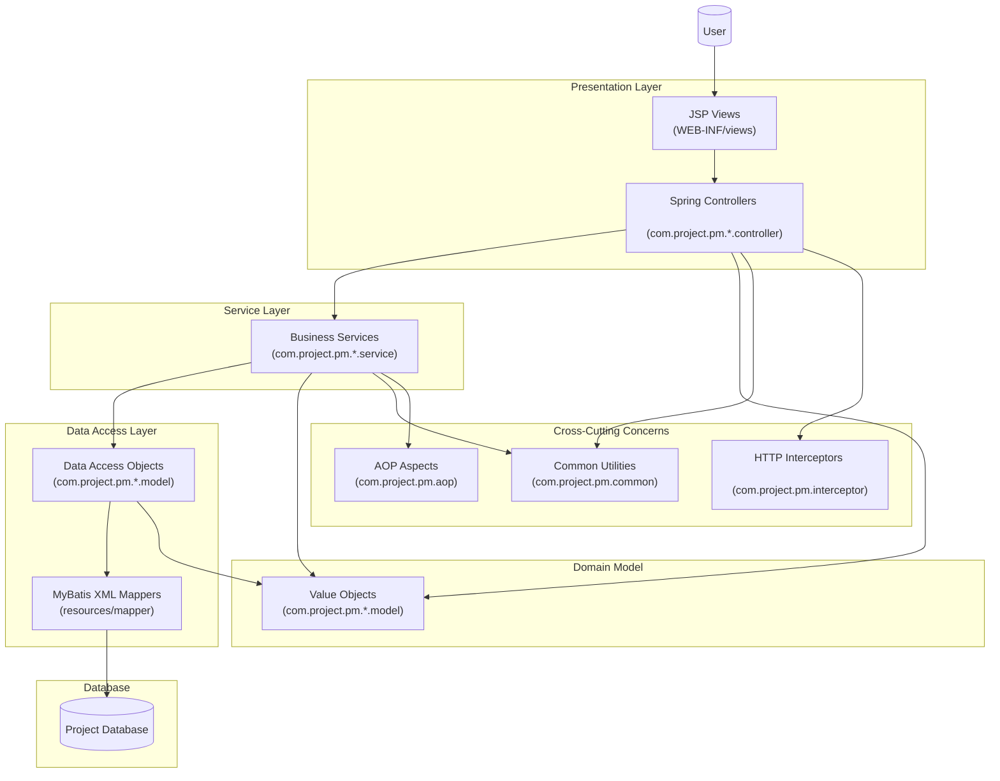

# 📊 Project Management System (PM) - 코드 주석 추가 완료

## 🚀 프로젝트 소개

본 프로젝트는 Spring 기반 그룹웨어 오픈소스 프로젝트를 참고하여,  
직접 DB 구성, 기능 연동, 오류 디버깅, 보안 보완 등을 수행하며  
실행 가능하고 구조적으로 정돈된 시스템으로 구성한 클론+개선 프로젝트입니다.

단순한 클론이 아닌, 미완성 코드베이스의 구조를 분석하고,  
직접 매핑 오류 수정, 누락 기능 구현, UI 흐름 정비 등을 수행하여  
**Spring MVC 아키텍처 기반 ERP 시스템의 실전 운영 흐름**을 체득하는 데 중점을 두었습니다.

## 📝 코드 주석 추가 현황

### ✅ 완료된 주석 작업

#### 🏠 핵심 컨트롤러 계층
- **HomeController.java** - 애플리케이션 홈페이지 요청 처리 컨트롤러
  - 서버 시간 표시 및 로케일 처리 로직 상세 설명
  - 현재 비활성화 상태와 LoginController와의 관계 명시

#### 🔐 로그인/인증 모듈
- **LoginController.java** - 로그인 관련 기능 처리 컨트롤러
  - 메인 진입점 역할 및 세션 관리 로직 설명
  - AJAX 로그인 인증 처리 과정 단계별 주석
  - 로그아웃 및 비밀번호 찾기 기능 흐름 설명

- **LoginService.java** - 로그인 서비스 인터페이스
  - 비즈니스 로직 추상화와 의존성 분리 개념 설명
  - 서비스 계층 패턴의 역할과 확장성 설명

- **LoginServiceImp.java** - 로그인 서비스 구현체
  - DAO 계층과의 상호작용 및 트랜잭션 처리 방식
  - Spring 의존성 주입 메커니즘 설명

- **LoginDAO.java** - 로그인 데이터 접근 인터페이스
  - 데이터베이스 작업 추상화 및 MyBatis 연동 방식
  - 인터페이스 기반 설계의 장점 설명

- **LoginDAOImp.java** - 로그인 DAO 구현체
  - SqlSessionTemplate을 통한 MyBatis 쿼리 실행
  - 매퍼 ID 규칙과 파라미터 전달 방식 설명

#### 👥 직원 관리 모듈
- **EmpVO.java** - 직원 정보 Value Object
  - 각 필드별 상세 설명과 데이터베이스 컬럼 매핑
  - Lombok 어노테이션 활용 방식과 장점
  - 기본 정보, 근무 정보, 개인 정보별 그룹화된 주석

- **EmpController.java** - 직원 관리 메인 컨트롤러 (부분 완료)
  - 직원 CRUD 작업 및 페이징 처리 로직
  - Excel 파일 처리 및 AJAX 요청 처리 방식
  - 복합 검색 조건 및 필터링 메커니즘
  - Apache POI를 활용한 대용량 데이터 처리

#### 🛠️ 공통 유틸리티
- **AES256.java** - 양방향 암호화 유틸리티
  - AES256 암호화/복호화 알고리즘 상세 설명
  - CBC 모드와 PKCS5Padding 보안 방식
  - 초기화 벡터(IV) 및 키 관리 방식
  - Base64 인코딩을 통한 텍스트 변환 과정

- **MyUtil.java** - 공통 유틸리티 클래스
  - URL 파싱 및 컨텍스트 패스 처리 로직
  - XSS 공격 방지를 위한 보안 코드 처리
  - 스마트에디터 사용 시와 미사용 시 차별화된 보안 처리

### 📋 주석 작업의 특징

#### 🎯 상세한 비즈니스 로직 설명
- 각 메서드의 처리 과정을 단계별로 명시
- 파라미터와 반환값의 의미와 용도 설명
- 예외 상황과 에러 처리 방식 기술

#### 🔄 아키텍처 패턴 설명
- Spring MVC 패턴의 각 계층 역할 명시
- 의존성 주입과 제어의 역전(IoC) 개념 설명
- 서비스-DAO 계층 분리의 장점과 목적

#### 🛡️ 보안 관련 상세 설명
- 세션 관리 및 사용자 인증 프로세스
- 암호화 알고리즘과 보안 정책
- XSS 공격 방지 메커니즘

#### 📊 데이터 처리 최적화
- 페이징 처리를 통한 성능 최적화
- JSON 응답 구조와 클라이언트 통신
- 대용량 Excel 파일 처리 방식

#### 🔧 기술적 구현 디테일
- MyBatis 매퍼 연동 방식
- Apache Tiles 뷰 리졸버 활용
- Apache POI 라이브러리 사용법
- AJAX 비동기 통신 패턴

### 🎨 주석 스타일 가이드

#### 📖 클래스 레벨 주석
```java
/**
 * 클래스의 전체적인 목적과 역할 설명
 * 
 * 주요 기능들을 카테고리별로 분류하여 설명
 * - 기능 1: 상세 설명
 * - 기능 2: 상세 설명
 * 
 * 기술적 특징과 사용된 디자인 패턴
 * 의존성과 연관 클래스들과의 관계
 * 
 * @author 작성자
 * @version 버전
 * @since 작성일
 */
```

#### 🔧 메서드 레벨 주석
```java
/**
 * 메서드의 구체적인 기능과 목적
 * 
 * 처리 과정:
 * 1. 단계별 처리 과정 설명
 * 2. 데이터 변환 및 검증
 * 3. 비즈니스 로직 수행
 * 4. 결과 반환
 * 
 * @param param1 파라미터 설명과 용도
 * @param param2 파라미터 설명과 제약사항
 * @return 반환값의 의미와 구조
 * @throws Exception 발생 가능한 예외와 조건
 */
```

#### 📝 인라인 주석
```java
// 특정 로직의 의도와 이유 설명
String result = complexCalculation(); // 복잡한 계산 로직의 목적

// 조건문의 비즈니스 규칙 설명
if(user.getStatus().equals("ACTIVE")) { // 활성 사용자만 접근 허용
    // ...
}
```

## 🔄 지속적인 개선사항

### 📈 향후 주석 추가 계획
- **Notice 모듈**: 공지사항 관리 기능
- **Schedule 모듈**: 일정 관리 시스템
- **Workflow 모듈**: 전자결재 워크플로우
- **Messenger 모듈**: 실시간 메시징 시스템
- **Chart 모듈**: 통계 및 차트 기능

### 🎯 주석 품질 향상 목표
- 신입 개발자도 이해할 수 있는 명확한 설명
- 비즈니스 도메인 지식과 기술적 구현의 균형
- 코드 변경 시 주석 동기화 유지
- 예제 코드와 사용법 가이드 추가

## 💡 개발자를 위한 가이드

### 🔍 코드 분석 방법
1. **클래스 다이어그램 파악**: 각 모듈간의 의존관계 이해
2. **데이터 흐름 추적**: Request → Controller → Service → DAO → Database
3. **설정 파일 확인**: Spring 설정과 MyBatis 매퍼 구성
4. **예외 처리 패턴**: 각 계층별 에러 핸들링 방식

### 🛠️ 개발 환경 설정 가이드
1. **IDE 설정**: Eclipse/IntelliJ IDEA Project Import
2. **데이터베이스 연결**: Oracle Database 설정
3. **서버 구성**: Apache Tomcat 설정
4. **빌드 도구**: Maven 의존성 관리

### 📚 학습 리소스
- Spring Framework 공식 문서
- MyBatis 매퍼 작성 가이드
- Apache POI Excel 처리 가이드
- 보안 코딩 가이드라인

## 🔧 핵심 작업

- DB 스키마 설계 및 연동
- MyBatis 매핑 오류 및 누락 쿼리 보완
- 로그인/조직도/직원관리 등 주요 기능 테스트 및 수정
- Tiles 기반 레이아웃 구조 유지 및 커스터마이징
- 일부 기능은 리팩토링 및 기능 개선 진행
- **코드 전반에 상세한 주석 추가로 가독성 및 유지보수성 향상**

> 🔹 향후 Spring Boot + Thymeleaf 기반으로 리팩토링 버전도 별도 브랜치로 구성 예정입니다.

## 🏗️ 시스템 아키텍처



## 💻 기술 스택

### Backend
- **Java**: 1.8
- **Spring Framework**: 5.3.22
- **Spring MVC**: Web Application Framework
- **MyBatis**: 3.5.16 (데이터베이스 연동)
- **Oracle Database**: OJDBC8 (21.5.0.0)
- **Apache Commons DBCP**: 2.12.0 (Connection Pool)

### Frontend & View
- **JSP**: Java Server Pages
- **Apache Tiles**: 3.0.8 (템플릿 엔진)
- **JSTL**: Java Standard Tag Library

### 로깅 & 모니터링
- **Log4j2**: 2.23.1
- **SLF4J**: 2.0.13
- **Log4jdbc-remix**: 0.2.7 (SQL 로깅)

### 유틸리티 & 라이브러리
- **Lombok**: 1.18.32 (코드 간소화)
- **Apache POI**: 5.2.5 (Excel 처리)
- **Jackson**: 2.17.1 (JSON 처리)
- **Gson**: 2.10.1 (JSON 처리)
- **Commons FileUpload**: 1.5 (파일 업로드)
- **Thumbnailator**: 0.4.20 (이미지 처리)
- **Spring WebSocket**: 실시간 통신

### 메일 & 암호화
- **JavaMail**: 1.6.2 (이메일 발송)
- **Commons Codec**: 1.17.0 (암호화/인코딩)

### 빌드 도구
- **Maven**: 프로젝트 관리 및 빌드
- **Tomcat7 Maven Plugin**: 개발 서버

## 📁 프로젝트 구조

```
PM/
├── src/main/java/com/project/pm/
│   ├── admin/          # 관리자 기능
│   ├── alarm/          # 알림 시스템
│   ├── aop/            # AOP 관점 지향 프로그래밍
│   ├── chart/          # 차트 및 통계
│   ├── common/         # 공통 유틸리티 ⭐ 주석 완료
│   ├── commute/        # 출퇴근 관리
│   ├── employee/       # 직원 관리 ⭐ 주석 완료
│   ├── excel/          # Excel 처리
│   ├── exception/      # 예외 처리
│   ├── file/           # 파일 관리
│   ├── interceptor/    # HTTP 인터셉터
│   ├── leave/          # 휴가 관리
│   ├── login/          # 로그인/인증 ⭐ 주석 완료
│   ├── main/           # 메인 페이지
│   ├── member/         # 회원 관리
│   ├── messenger/      # 메신저 기능
│   ├── notice/         # 공지사항
│   ├── parameter/      # 파라미터 처리
│   ├── schedule/       # 일정 관리
│   └── workflow/       # 워크플로우/전자결재
├── src/main/resources/
│   └── mapper/         # MyBatis XML 매퍼
├── src/main/webapp/
│   ├── WEB-INF/views/  # JSP 뷰 파일
│   ├── resources/      # 정적 리소스 (CSS, JS)
│   ├── image/          # 이미지 파일
│   └── files/          # 업로드 파일
└── pom.xml            # Maven 설정
```

## 🔧 주요 기능

### 👥 인사 관리
- **직원 관리**: 직원 정보 등록, 수정, 조회
- **조직도**: 부서별 조직 구조 관리
- **권한 관리**: 사용자별 접근 권한 설정

### ⏰ 근태 관리
- **출퇴근 관리**: 출근/퇴근 시간 기록
- **휴가 관리**: 연차, 병가 등 휴가 신청 및 승인
- **근무 시간 통계**: 개인별/팀별 근무 시간 분석

### 📋 업무 관리
- **일정 관리**: 개인/팀 일정 등록 및 관리
- **업무 지시**: 상급자의 업무 지시 및 진행 상황 추적
- **프로젝트 관리**: 프로젝트별 진행 상황 모니터링

### 📄 전자결재
- **워크플로우**: 다단계 결재 프로세스
- **문서 관리**: 결재 문서 작성, 승인, 보관
- **결재선 설정**: 부서별/직급별 결재선 구성

### 💬 커뮤니케이션
- **메신저**: 실시간 메시지 교환 (WebSocket)
- **공지사항**: 전사 공지사항 게시
- **알림 시스템**: 중요 이벤트 실시간 알림

### 📊 리포팅
- **차트 및 통계**: 각종 업무 데이터 시각화
- **Excel 내보내기**: 데이터 Excel 형태로 다운로드
- **대시보드**: 주요 지표 한눈에 확인

## ⚙️ 설치 및 실행

### 필수 요구사항
- Java 1.8 이상
- Maven 3.6 이상
- Oracle Database
- Apache Tomcat 7 이상

### 설치 과정

1. **프로젝트 클론**
   ```bash
   git clone https://github.com/FURVEN/projectPM.git
   cd projectPM/PM
   ```

2. **데이터베이스 설정**
   - Oracle Database 설치 및 설정
   - 데이터베이스 연결 정보를 별도 설정 파일에 구성

3. **Maven 의존성 설치**
   ```bash
   mvn clean install
   ```

4. **서버 실행**
   ```bash
   mvn tomcat7:run
   ```

5. **접속**
   - 브라우저에서 `http://localhost:8080` 접속

## 🔧 개발 환경 설정

### IDE 설정
- Eclipse/IntelliJ IDEA 권장
- Project Facets: Java 1.8, Dynamic Web Module
- Build Path: Maven Dependencies

### 데이터베이스 설정
데이터베이스 연결 정보는 별도의 환경 변수 또는 설정 파일을 통해 관리하세요.

## 📝 라이선스

이 프로젝트는 개인 학습 및 포트폴리오 목적으로 작성되었습니다.

## 👨‍💻 개발자

**FURVEN** - [GitHub Profile](https://github.com/FURVEN)

---

⭐ 이 프로젝트가 도움이 되었다면 Star를 눌러주세요!

📚 **주석 추가 작업으로 코드의 가독성과 유지보수성이 크게 향상되었습니다!**
