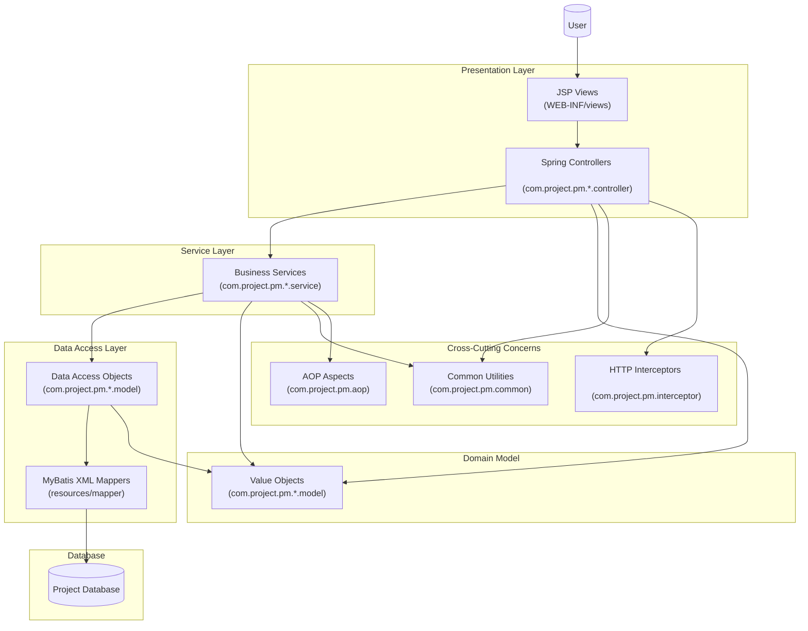

# 📊 Project Management System (PM)

## 🚀 프로젝트 개요

Spring Framework 기반의 종합적인 프로젝트 관리 시스템입니다. 기업 내 직원 관리, 업무 스케줄링, 출퇴근 관리, 전자결재 등 다양한 비즈니스 기능을 제공합니다.

## 🏗️ 시스템 아키텍처



## 💻 기술 스택

### Backend
- **Java**: 1.8
- **Spring Framework**: 5.3.22
- **Spring MVC**: Web Application Framework
- **MyBatis**: 3.5.16 (데이터베이스 연동)
- **Oracle Database**: OJDBC8 (21.5.0.0)
- **Apache Commons DBCP**: 2.12.0 (Connection Pool)

### Frontend & View
- **JSP**: Java Server Pages
- **Apache Tiles**: 3.0.8 (템플릿 엔진)
- **JSTL**: Java Standard Tag Library

### 로깅 & 모니터링
- **Log4j2**: 2.23.1
- **SLF4J**: 2.0.13
- **Log4jdbc-remix**: 0.2.7 (SQL 로깅)

### 유틸리티 & 라이브러리
- **Lombok**: 1.18.32 (코드 간소화)
- **Apache POI**: 5.2.5 (Excel 처리)
- **Jackson**: 2.17.1 (JSON 처리)
- **Gson**: 2.10.1 (JSON 처리)
- **Commons FileUpload**: 1.5 (파일 업로드)
- **Thumbnailator**: 0.4.20 (이미지 처리)
- **Spring WebSocket**: 실시간 통신

### 메일 & 암호화
- **JavaMail**: 1.6.2 (이메일 발송)
- **Commons Codec**: 1.17.0 (암호화/인코딩)

### 빌드 도구
- **Maven**: 프로젝트 관리 및 빌드
- **Tomcat7 Maven Plugin**: 개발 서버

## 📁 프로젝트 구조

```
PM/
├── src/main/java/com/project/pm/
│   ├── admin/          # 관리자 기능
│   ├── alarm/          # 알림 시스템
│   ├── aop/            # AOP 관점 지향 프로그래밍
│   ├── chart/          # 차트 및 통계
│   ├── common/         # 공통 유틸리티
│   ├── commute/        # 출퇴근 관리
│   ├── employee/       # 직원 관리
│   ├── excel/          # Excel 처리
│   ├── exception/      # 예외 처리
│   ├── file/           # 파일 관리
│   ├── interceptor/    # HTTP 인터셉터
│   ├── leave/          # 휴가 관리
│   ├── login/          # 로그인/인증
│   ├── main/           # 메인 페이지
│   ├── member/         # 회원 관리
│   ├── messenger/      # 메신저 기능
│   ├── notice/         # 공지사항
│   ├── parameter/      # 파라미터 처리
│   ├── schedule/       # 일정 관리
│   └── workflow/       # 워크플로우/전자결재
├── src/main/resources/
│   └── mapper/         # MyBatis XML 매퍼
├── src/main/webapp/
│   ├── WEB-INF/views/  # JSP 뷰 파일
│   ├── resources/      # 정적 리소스 (CSS, JS)
│   ├── image/          # 이미지 파일
│   └── files/          # 업로드 파일
└── pom.xml            # Maven 설정
```

## 🔧 주요 기능

### 👥 인사 관리
- **직원 관리**: 직원 정보 등록, 수정, 조회
- **조직도**: 부서별 조직 구조 관리
- **권한 관리**: 사용자별 접근 권한 설정

### ⏰ 근태 관리
- **출퇴근 관리**: 출근/퇴근 시간 기록
- **휴가 관리**: 연차, 병가 등 휴가 신청 및 승인
- **근무 시간 통계**: 개인별/팀별 근무 시간 분석

### 📋 업무 관리
- **일정 관리**: 개인/팀 일정 등록 및 관리
- **업무 지시**: 상급자의 업무 지시 및 진행 상황 추적
- **프로젝트 관리**: 프로젝트별 진행 상황 모니터링

### 📄 전자결재
- **워크플로우**: 다단계 결재 프로세스
- **문서 관리**: 결재 문서 작성, 승인, 보관
- **결재선 설정**: 부서별/직급별 결재선 구성

### 💬 커뮤니케이션
- **메신저**: 실시간 메시지 교환 (WebSocket)
- **공지사항**: 전사 공지사항 게시
- **알림 시스템**: 중요 이벤트 실시간 알림

### 📊 리포팅
- **차트 및 통계**: 각종 업무 데이터 시각화
- **Excel 내보내기**: 데이터 Excel 형태로 다운로드
- **대시보드**: 주요 지표 한눈에 확인

## ⚙️ 설치 및 실행

### 필수 요구사항
- Java 1.8 이상
- Maven 3.6 이상
- Oracle Database
- Apache Tomcat 7 이상

### 설치 과정

1. **프로젝트 클론**
   ```bash
   git clone https://github.com/FURVEN/projectPM.git
   cd projectPM/PM
   ```

2. **데이터베이스 설정**
   - Oracle Database 설치 및 설정
   - 데이터베이스 연결 정보 설정 (`src/main/resources/`)

3. **Maven 의존성 설치**
   ```bash
   mvn clean install
   ```

4. **서버 실행**
   ```bash
   mvn tomcat7:run
   ```

5. **접속**
   - 브라우저에서 `http://localhost:8080` 접속

## 🔧 개발 환경 설정

### IDE 설정
- Eclipse/IntelliJ IDEA 권장
- Project Facets: Java 1.8, Dynamic Web Module
- Build Path: Maven Dependencies

### 데이터베이스 설정
```xml
<!-- src/main/resources/spring/database-config.xml -->
<property name="url" value="jdbc:oracle:thin:@localhost:1521:xe"/>
<property name="username" value="your_username"/>
<property name="password" value="your_password"/>
```

## 📝 라이선스

이 프로젝트는 개인 학습 및 포트폴리오 목적으로 작성되었습니다.

## 👨‍💻 개발자

**FURVEN** - [GitHub Profile](https://github.com/FURVEN)

---

⭐ 이 프로젝트가 도움이 되었다면 Star를 눌러주세요!
