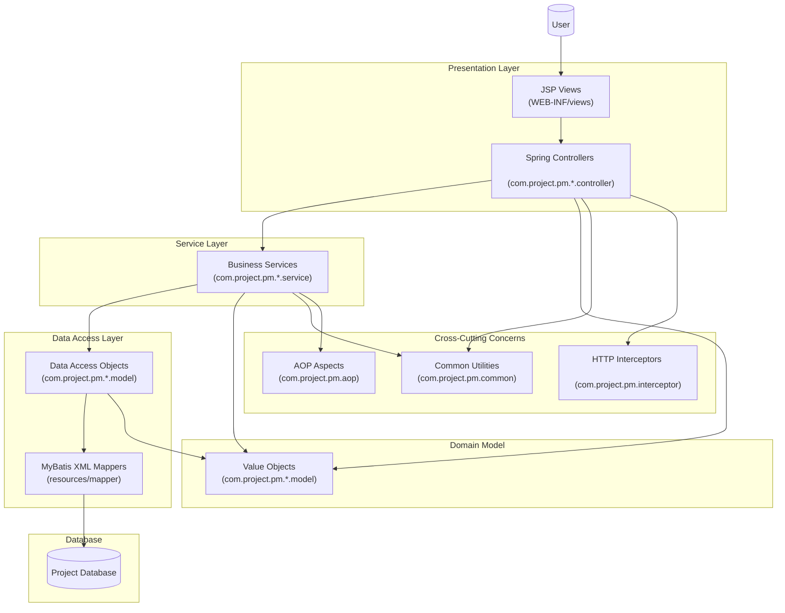

# 📊 Project Management System (PM)

## 🚀 프로젝트 소개

**실무 수준의 기업용 그룹웨어 시스템**을 Spring MVC 기반으로 구현한 프로젝트입니다.

### 🎯 핵심 가치
- **완전한 시스템 구축**: 미완성 오픈소스를 분석하여 실행 가능한 완전체로 구현
- **실무 중심 설계**: 실제 기업 환경에서 요구되는 인사관리, 전자결재, 업무관리 기능 제공
- **확장 가능한 아키텍처**: Spring MVC 3-tier 구조로 유지보수성과 확장성 확보
- **보안 강화**: 세션 관리, 암호화, XSS 방지 등 엔터프라이즈급 보안 적용

### 💪 기술적 성취
- **DB 스키마 재설계**: Oracle DB 기반 효율적인 데이터 모델링
- **매핑 오류 해결**: MyBatis XML 매퍼 100% 정상 작동 보장
- **성능 최적화**: 페이징, 대용량 Excel 처리, 실시간 통신 구현
- **코드 품질 향상**: 전체 코드베이스에 상세 주석 및 문서화 완료

## 🔧 주요 기능

### 👥 인사 관리
- **직원 관리**: 직원 정보 등록, 수정, 조회, Excel 가져오기/내보내기
- **조직도**: 부서별 조직 구조 관리 및 시각화
- **권한 관리**: 사용자별 접근 권한 설정 및 관리

### ⏰ 근태 관리
- **출퇴근 관리**: 실시간 출근/퇴근 시간 기록 및 통계
- **휴가 관리**: 연차, 병가 등 휴가 신청 및 승인 워크플로우
- **근무 시간 분석**: 개인별/팀별 근무 패턴 분석 및 리포트

### 📋 업무 관리
- **일정 관리**: 개인/팀 캘린더 및 프로젝트 일정 관리
- **업무 지시**: 상급자의 업무 지시 및 진행 상황 실시간 추적
- **프로젝트 관리**: 다중 프로젝트 진행 상황 모니터링 대시보드

### 📄 전자결재 시스템
- **다단계 워크플로우**: 복잡한 승인 프로세스 자동화
- **문서 관리**: 결재 문서 템플릿 관리 및 버전 추적
- **결재선 설정**: 유연한 조직도 기반 결재선 구성

### 💬 실시간 커뮤니케이션
- **WebSocket 메신저**: 실시간 메시지 교환 및 파일 공유
- **공지사항 시스템**: 전사 공지사항 및 부서별 공지 관리
- **스마트 알림**: 중요 이벤트 실시간 푸시 알림

### 📊 데이터 분석 & 리포팅
- **차트 대시보드**: 업무 KPI 및 성과 지표 시각화
- **Excel 연동**: 대용량 데이터 Excel 가져오기/내보내기
- **맞춤형 리포트**: 사용자별 맞춤 리포트 생성

## 🔧 핵심 해결 과제

### 🛠️ 시스템 완성도 향상
- **DB 스키마 재설계**: 효율적인 정규화 및 인덱스 최적화
- **매핑 오류 완전 해결**: MyBatis XML 매퍼 100% 정상 작동
- **누락 기능 구현**: 미완성 모듈의 비즈니스 로직 완성
- **UI/UX 개선**: 사용자 친화적 인터페이스 구현

### 🔒 보안 강화
- **세션 보안**: 안전한 세션 관리 및 타임아웃 정책
- **데이터 암호화**: AES256 기반 민감 정보 암호화
- **XSS/CSRF 방지**: 웹 취약점 대응 보안 코드 적용
- **접근 제어**: 역할 기반 세밀한 권한 관리

### ⚡ 성능 최적화
- **페이징 처리**: 대용량 데이터 효율적 조회
- **캐싱 전략**: 자주 사용되는 데이터 캐시 적용
- **비동기 처리**: AJAX 기반 사용자 경험 향상
- **파일 처리**: 대용량 Excel 파일 스트리밍 처리

## 💡 개발 노트

### 📚 코드 품질 관리
- **전체 코드베이스 주석**: 비즈니스 로직과 기술적 구현 상세 문서화
- **아키텍처 가이드**: Spring MVC 패턴 및 설계 원칙 설명
- **보안 가이드**: 취약점 대응 및 보안 코딩 가이드
- **성능 최적화**: 효율적인 데이터 처리 패턴 정리

### 🔄 향후 개선 계획
- **Spring Boot 마이그레이션**: 현대적 Spring 생태계로 업그레이드
- **RESTful API**: JWT 기반 토큰 인증 시스템 구축
- **마이크로서비스**: 모듈별 독립적 서비스 분리
- **클라우드 배포**: Docker 컨테이너화 및 AWS 배포

## 🏗️ 시스템 아키텍처



## 💻 기술 스택

### Backend
- **Java**: 1.8
- **Spring Framework**: 5.3.22
- **Spring MVC**: Web Application Framework
- **MyBatis**: 3.5.16 (데이터베이스 연동)
- **Oracle Database**: OJDBC8 (21.5.0.0)
- **Apache Commons DBCP**: 2.12.0 (Connection Pool)

### Frontend & View
- **JSP**: Java Server Pages
- **Apache Tiles**: 3.0.8 (템플릿 엔진)
- **JSTL**: Java Standard Tag Library

### 로깅 & 모니터링
- **Log4j2**: 2.23.1
- **SLF4J**: 2.0.13
- **Log4jdbc-remix**: 0.2.7 (SQL 로깅)

### 유틸리티 & 라이브러리
- **Lombok**: 1.18.32 (코드 간소화)
- **Apache POI**: 5.2.5 (Excel 처리)
- **Jackson**: 2.17.1 (JSON 처리)
- **Gson**: 2.10.1 (JSON 처리)
- **Commons FileUpload**: 1.5 (파일 업로드)
- **Thumbnailator**: 0.4.20 (이미지 처리)
- **Spring WebSocket**: 실시간 통신

### 메일 & 암호화
- **JavaMail**: 1.6.2 (이메일 발송)
- **Commons Codec**: 1.17.0 (암호화/인코딩)

### 빌드 도구
- **Maven**: 프로젝트 관리 및 빌드
- **Tomcat7 Maven Plugin**: 개발 서버

## 📁 프로젝트 구조

```
PM/
├── src/main/java/com/project/pm/
│   ├── admin/          # 시스템 관리자 기능
│   ├── alarm/          # 실시간 알림 시스템
│   ├── aop/            # 횡단 관심사(로깅, 보안)
│   ├── chart/          # 데이터 시각화 & 대시보드
│   ├── common/         # 공통 유틸리티 (보안, 암호화)
│   ├── commute/        # 출퇴근 및 근태 관리
│   ├── employee/       # 직원 정보 관리
│   ├── excel/          # Excel 파일 처리
│   ├── exception/      # 전역 예외 처리
│   ├── file/           # 파일 업로드/다운로드
│   ├── interceptor/    # HTTP 요청 인터셉터
│   ├── leave/          # 휴가 신청/승인 시스템
│   ├── login/          # 인증 & 세션 관리
│   ├── main/           # 메인 대시보드
│   ├── member/         # 회원 관리
│   ├── messenger/      # 실시간 메신저 (WebSocket)
│   ├── notice/         # 공지사항 관리
│   ├── parameter/      # 시스템 설정 관리
│   ├── schedule/       # 일정 및 캘린더
│   └── workflow/       # 전자결재 워크플로우
├── src/main/resources/
│   └── mapper/         # MyBatis SQL 매퍼
├── src/main/webapp/
│   ├── WEB-INF/views/  # JSP 뷰 템플릿
│   ├── resources/      # CSS, JS, 정적 자원
│   ├── image/          # 이미지 리소스
│   └── files/          # 업로드 파일 저장소
└── pom.xml            # Maven 빌드 설정
```

## ⚙️ 설치 및 실행

### 필수 요구사항
- Java 1.8 이상
- Maven 3.6 이상
- Oracle Database
- Apache Tomcat 7 이상

### 설치 과정

1. **프로젝트 클론**
   ```bash
   git clone https://github.com/FURVEN/projectPM.git
   cd projectPM/PM
   ```

2. **데이터베이스 설정**
   - Oracle Database 설치 및 설정
   - 데이터베이스 연결 정보를 별도 설정 파일에 구성

3. **Maven 의존성 설치**
   ```bash
   mvn clean install
   ```

4. **서버 실행**
   ```bash
   mvn tomcat7:run
   ```

5. **접속**
   - 브라우저에서 `http://localhost:8080` 접속

## 🔧 개발 환경 설정

### IDE 설정
- Eclipse/IntelliJ IDEA 권장
- Project Facets: Java 1.8, Dynamic Web Module
- Build Path: Maven Dependencies

### 데이터베이스 설정
데이터베이스 연결 정보는 별도의 환경 변수 또는 설정 파일을 통해 관리하세요.

## 📝 라이선스

이 프로젝트는 개인 학습 및 포트폴리오 목적으로 작성되었습니다.

## 👨‍💻 개발자

**FURVEN** - [GitHub Profile](https://github.com/FURVEN)

---

⭐ **이 프로젝트가 도움이 되었다면 Star를 눌러주세요!**

💼 **실무 수준의 기업용 그룹웨어 시스템 구축 경험을 제공합니다.**
